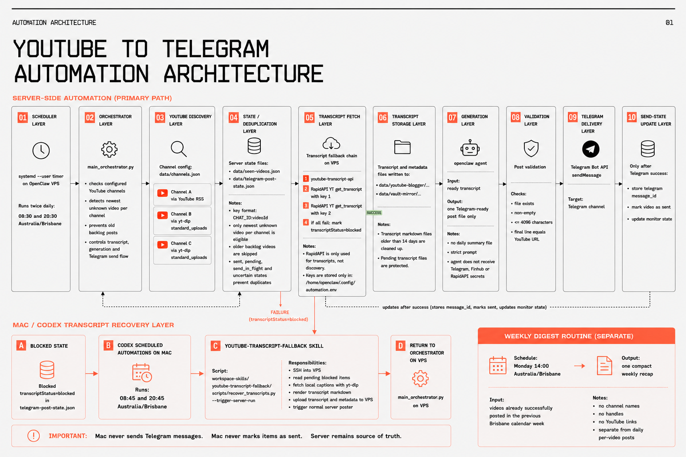

# OpenClaw YouTube Telegram Automation Skill

This Codex skill documents and guides the setup of a duplicate-safe YouTube-to-Telegram automation for an OpenClaw VPS.

It is designed for workflows where a server checks configured YouTube channels, discovers the newest eligible video, fetches or recovers a transcript, asks OpenClaw to create exactly one Telegram-ready post, validates the output, sends it through the Telegram Bot API, and updates send state only after Telegram confirms success.



## What The Skill Covers

- Building or reviewing the OpenClaw VPS automation architecture.
- Scheduling the main workflow with `systemd --user` timers.
- Discovering YouTube uploads through RSS or `yt-dlp` standard upload feeds.
- Fetching transcripts through a fallback chain:
  1. `youtube-transcript-api`
  2. RapidAPI transcript endpoint with key 1
  3. RapidAPI transcript endpoint with key 2
  4. Local Mac/Codex recovery using `yt-dlp` captions
- Storing transcript and metadata files in predictable server paths.
- Generating one Telegram-ready post with OpenClaw.
- Validating Telegram output before sending.
- Sending through Telegram Bot API `sendMessage`.
- Updating send state only after Telegram success.
- Handling blocked transcript recovery without letting the local Mac send messages or mark posts as sent.
- Designing an optional weekly digest routine from already posted videos.

## Core Safety Model

The VPS is the source of truth. It owns discovery, state, generation, Telegram sending, and final send-state updates.

The local Mac/Codex automation is recovery-only. It may SSH into the VPS, read blocked transcript state, fetch captions locally, upload transcript files, and trigger the normal server poster. It must not send Telegram messages and must not mark videos as sent.

The skill intentionally uses placeholders in examples and should never expose real Telegram bot tokens, chat IDs, RapidAPI keys, Finnhub keys, OpenClaw credentials, or production channel identifiers.

## Main Flow

```text
systemd --user timer
-> Python orchestrator on VPS
-> YouTube discovery
-> state and deduplication
-> transcript fallback chain
-> transcript storage
-> OpenClaw post generation
-> validation
-> Telegram Bot API sendMessage
-> send-state update after Telegram success
```

## Repository Contents

- `SKILL.md` - Codex skill definition, routing rules, non-negotiables, and default architecture.
- `agents/openai.yaml` - Skill display metadata and default prompt.
- `references/architecture.md` - Full architecture reference and Mermaid flowchart.
- `references/setup-blueprint.md` - Fresh VPS setup blueprint with generic examples.
- `references/operations.md` - Verification, troubleshooting, deployment, and recovery guidance.
- `references/prompt-contracts.md` - OpenClaw prompt contracts, Telegram validation rules, and diagram prompt.
- `openclaw-youtube-telegram-automation-flowchart.png` - Visual architecture overview.

## Intended Use

Use this skill when you want Codex to design, implement, troubleshoot, document, or review an OpenClaw YouTube-to-Telegram automation with transcript fallbacks and duplicate-safe Telegram delivery.
