# Architecture Reference

Use this reference to explain, review, or diagram the generic YouTube-to-Telegram automation.

## Components

### Scheduler Layer

Use `systemd --user` timers on the OpenClaw VPS. Example schedule:

```ini
OnCalendar=*-*-* 08:30:00 Australia/Brisbane
OnCalendar=*-*-* 20:30:00 Australia/Brisbane
Persistent=true
```

The timer starts one Python orchestrator. Do not schedule OpenClaw directly. The orchestrator decides whether work exists.

### Orchestrator Layer

Example script name:

```text
scripts/youtube_telegram_post.py
```

Responsibilities:

- load server-local env,
- lock the run to prevent overlap,
- discover newest videos per channel,
- skip old backlog,
- fetch or recover transcripts,
- invoke OpenClaw only when a transcript is ready,
- validate Telegram post output,
- send via Telegram Bot API,
- update state only after success.

### YouTube Discovery Layer

Store channels in:

```text
data/channels.json
```

Example:

```json
[
  {
    "channel": "@ExampleFinanceChannel",
    "enabled": true,
    "discoveryMode": "rss"
  },
  {
    "channel": "@ExampleMacroChannel",
    "enabled": true,
    "discoveryMode": "standard_uploads"
  }
]
```

Discovery modes:

- `rss`: use `https://www.youtube.com/feeds/videos.xml?channel_id=<CHANNEL_ID>` after channel id is known.
- `standard_uploads`: use `yt-dlp` against the channel `/videos` page to read newest uploads.

Rule: only the newest unknown video per channel is eligible. If a newer video is already known or posted, do not later post older backlog videos.

### State And Deduplication Layer

Use JSON state under the agent workspace:

```text
data/seen-videos.json
data/telegram-post-state.json
```

Recommended send-state key:

```text
TELEGRAM_CHAT_ID:videoId
```

Recommended states:

- `sent`: Telegram returned `message_id`; safe to skip forever.
- `pending`: work exists but is not sent.
- `send_in_flight`: Telegram request started; do not blindly retry after crash.
- `uncertain`: send status is ambiguous; manually reconcile against Telegram.

The orchestrator writes `sent` only after Telegram returns success.

### Transcript Fetch Layer

Fallback order:

```text
1. youtube-transcript-api
2. RapidAPI YT Data + Download API /get_transcript with key 1
3. RapidAPI /get_transcript with key 2
4. local Mac/Codex fallback using yt-dlp captions
```

RapidAPI endpoint:

```text
GET https://yt-api.p.rapidapi.com/get_transcript?id=<VIDEO_ID>
```

RapidAPI is only used for transcripts, not discovery.

If all server-side transcript methods fail, write a pending item:

```json
{
  "transcriptStatus": "blocked",
  "videoId": "VIDEO_ID",
  "videoUrl": "https://www.youtube.com/watch?v=VIDEO_ID",
  "transcriptPath": "data/youtube-blogger/.../transcripts/video.md",
  "metadataPath": "data/youtube-blogger/.../metadata/video.json",
  "postPath": "data/youtube-blogger/.../telegram/video.md",
  "blockedReason": "RequestBlocked or transcript fetch failed",
  "blockedAt": "ISO_TIMESTAMP"
}
```

### Transcript Storage Layer

Recommended paths:

```text
data/youtube-blogger/<channel>/<video>/transcript.md
data/youtube-blogger/<channel>/<video>/metadata.json
data/vault-mirror/Youtube Blogger/<channel>/Transcripts/<video>.md
```

Keep metadata additive. For RapidAPI transcripts, include:

```json
{
  "transcriptSource": "rapidapi-yt-api"
}
```

Retain transcript Markdown files for a bounded period, for example 14 days. Protect files referenced by pending state. Do not delete Telegram post files, metadata, or send-state.

### OpenClaw Generation Layer

OpenClaw receives the ready transcript and writes exactly one Telegram post file.

Security rule: do not pass unrelated secrets to the OpenClaw child process. Strip at least:

```text
TELEGRAM_BOT_TOKEN
RAPIDAPI_YT_TRANSCRIPT_KEYS
FINNHUB_API_KEY
```

### Validation And Telegram Delivery

Validate before sending:

- post file exists,
- non-empty,
- `<= 4096` characters,
- final line equals the YouTube URL.

Send with Telegram Bot API:

```text
POST https://api.telegram.org/bot<TELEGRAM_BOT_TOKEN>/sendMessage
```

Then store Telegram `message_id` in send-state.

### Mac / Codex Recovery Layer

Use local Codex automations after server timers, for example:

```text
08:45 Australia/Brisbane
20:45 Australia/Brisbane
```

The Mac recovery job:

- SSHes into the VPS,
- reads pending blocked items,
- uses local `yt-dlp` to fetch captions,
- writes transcript Markdown and metadata,
- uploads them to the VPS,
- triggers the normal server orchestrator.

The Mac must not send Telegram messages or mark items as sent.

## Flowchart

```mermaid
flowchart LR
  T["systemd --user timer<br/>08:30 + 20:30 Brisbane"] --> O["Python orchestrator<br/>youtube_telegram_post.py"]
  O --> D["YouTube discovery<br/>RSS or yt-dlp standard_uploads"]
  D --> S["State + dedupe<br/>seen-videos.json<br/>telegram-post-state.json"]
  S --> F["Transcript fallback chain"]
  F --> YTA["youtube-transcript-api"]
  YTA -->|success| W["Write transcript + metadata"]
  YTA -->|fail| R1["RapidAPI key 1"]
  R1 -->|success| W
  R1 -->|fail| R2["RapidAPI key 2"]
  R2 -->|success| W
  R2 -->|fail| B["pending transcriptStatus=blocked"]
  B --> M["Mac/Codex recovery<br/>local yt-dlp captions"]
  M --> W
  W --> A["OpenClaw agent<br/>writes Telegram post only"]
  A --> V["Validate post<br/>non-empty, <=4096, final line URL"]
  V --> TG["Telegram Bot API sendMessage"]
  TG --> SS["Mark sent after message_id"]
```


